About us
========

writing Haskell for a year and a half  at MIT Lincoln Laboratory

`mazumder@ll.mit.edu`

`tbraje@ll.mit.edu`

# Outline

* Haskell Crash Course

* Phantom Types for Enforced Sanitization

* Servant -- A Web API as a Type

* Functional Reactive Programming for the GUI

# Motivation

* Types are the lightest-weight verification tool
* Automates reasoning about your code
* Security and correctness are tied

<br/>

<div class="mdl-grid">
<div class="mdl-cell mdl-cell--6-col">
* Security - properties of your code <i class="material-icons magenta">arrow_forward</i>
* Tests - imprecise specifications <i class="material-icons magenta">arrow_forward</i>
* Types - precise specifications <i class="material-icons magenta">arrow_forward</i>
* Difficult: code review verification <i class="material-icons magenta">arrow_forward</i>
</div>
<div class="mdl-cell mdl-cell--6-col">
* Add security properties to types
* Tests exercise finite inputs
* Forced to adhere to a contract
* Easy: compiler verification
</div>
</div>

# A Brief Tour of the Haskell Ecosystem
* Types as a specification: precise properties
    * Correctness ~ Security
* `LiquidHaskell`{.magentac}: provable properties
* `Phantom Types`{.bluec}: lightweight enforcement against SQLi, XSS
* `Functional Reactive Programming`{.greenc}: callback-free user interfaces
* `TypeFamilies`{.orangec}: type-level programming
* `Software Transactional Memory`{.redc}: easy concurrency (no locks)

<!--
  --
  --
  -- Haskell Introduction
  --
  --
  -->

# Questions for pairing up

* Haskell experience?
* Vim or Emacs?
* Docker?
* GHCJS/Reflex/Servant?

# Docker Basics

<div class="mdl-grid"><div class="mdl-cell mdl-cell--6-col">
Right now, update:
```bash
$ docker pull mmaz/secdev
```
</div><div class="mdl-cell mdl-cell--6-col">
Test it out:
```bash
$ docker run --rm -it mmaz/secdev /bin/intro
```

```
[0,1,2,3,4,5]
...
```
</div></div>

<br/>

Behind a proxy?
```bash
$ docker run \
  -e "http_proxy=..." -e "https_proxy=..." -e "HTTP_PROXY=..." -e "HTTPS_PROXY=..."  \
  --rm -it mmaz/secdev /bin/intro
```

# Docker Run

```bash
$ docker run -p 8080:8080 --rm -it mmaz/secdev /bin/bash
$ secdev> exit # or Ctrl-d
```

* `-e`{.redc} environment variable `"foo=bar"`
* `-p`{.redc} port mapping
* `--rm`{.redc} stateless (don't persist changes)
* `-i`{.redc} interactive (don't background)
* `-t`{.redc} tag name (`mmaz/secdev`)

```bash
$ docker run -p 8080:8080 --rm -it mmaz/secdev /bin/ghci
GHCi, version 8.0.1
Prelude> 3 + 4
7
Prelude> :quit -- or Ctrl-D
```

# Spacemacs: Emacs + Vim

<div class="mdl-grid"><div class="mdl-cell mdl-cell--6-col">
```bash
$ docker run --rm -it mmaz/secdev /bin/bash
$ secdev> emacs AddTwoNumbers.hs
# Alternatively
#         vim  AddTwoNumbers.hs
#         nano AddTwoNumbers.hs
$ secdev> exit #or Ctrl-d
```
</div><div class="mdl-cell mdl-cell--6-col">
* Default: Vim-Mode
* Quit `:q Enter` (or `Esc :q Enter`)
* Switch to emacs-mode: `SPC t E e`
* Exit from emacs-mode: `Ctrl-x Ctrl-c`
* Exit from nano: `Ctrl-x`

</div></div>


# Haskell Crash Course


<div class="footnote">
[Source: XKCD](https://xkcd.com/1312/)
</div>

# Intro to Haskell
<div class="mdl-grid">
<div class="mdl-cell mdl-cell--1-col">
</div>
<div class="mdl-cell mdl-cell--2-col">
Haskell:

`x :: A`{.haskell}

`x = y`{.haskell}

`A -> B`{.haskell}
</div>
<div class="mdl-cell mdl-cell--3-col">
Meaning:

`x`{.redc} has type `A`{.haskell}

`x`{.redc} defined to be `y`{.greenc}

function from `A`{.haskell} to `B`{.haskell}

</div>
<div class="mdl-cell mdl-cell--6-col">
```haskell
theNumberFive :: Int   -- type declaration
theNumberFive = 5      -- definition

show :: Int -> String  -- function type

$ stack ghci           -- interactive repl
>>> theNumberFive
5 :: Int
>>> show theNumberFive
"5" :: String
```
</div>
</div>

`--double dash for code comments`{.haskell}

String literals like `"5"`{.haskell} are doublequoted

# Intro to Haskell
Let's convert this C function to Haskell

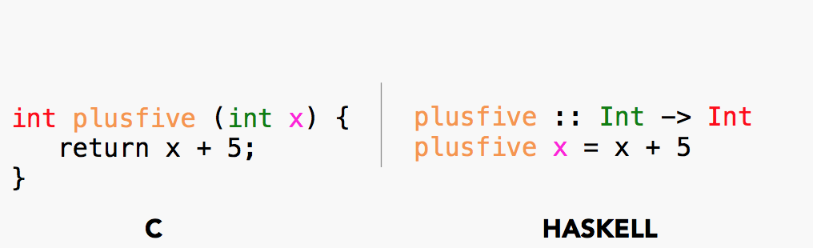

# Intro to Haskell
don't need a type signature: still valid Haskell

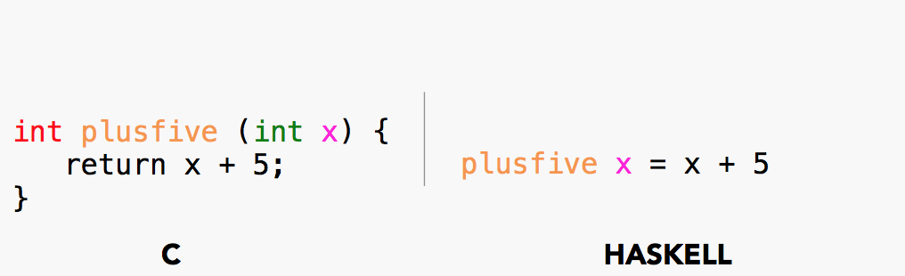

# Intro to Haskell
the function name


# Intro to Haskell
a return value C is a definition in Haskell

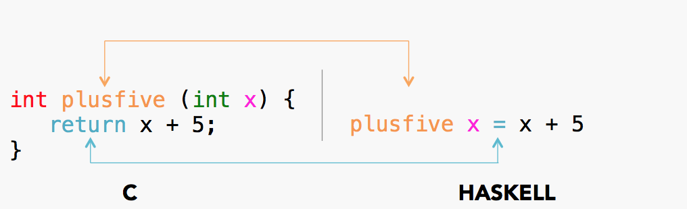

# Intro to Haskell
how do we read a type signature?


# Intro to Haskell
still have the function name (like a header file in C)


# Intro to Haskell
this is the `type`{.greenc} of the `argument`{.greenc} to `plusfive`{.orangec}


# Intro to Haskell
Types read left-to-right. `argument`{.greenc} type to ("`->`{.haskell}") `return`{.redc} type

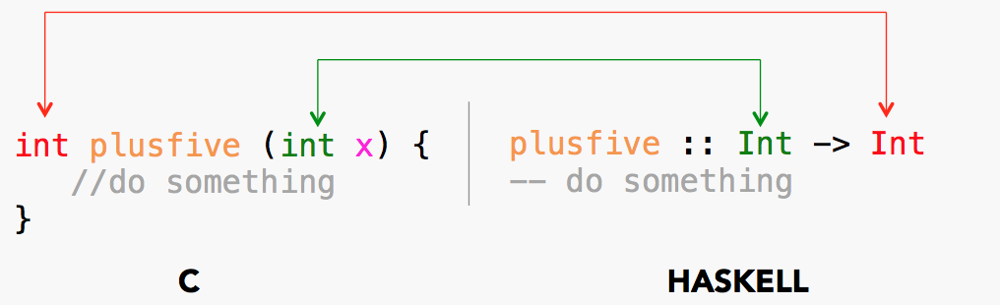

# Intro to Haskell
name the argument value "`x`{.magentac}" in the lexical scope


# Intro to Haskell
use "`x`{.magentac}" in the function definition

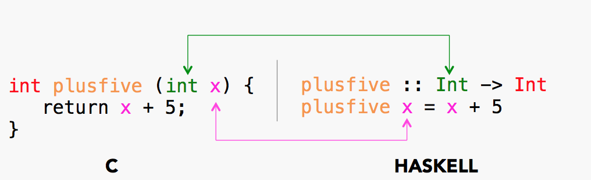

# Intro to Haskell
all together: the `input type`{.greenc}`,` the `output type`{.redc}`,` and the `name-binding`{.magentac}

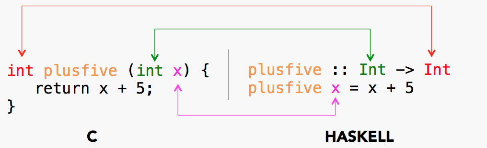

# Intro to Haskell
what about multiple arguments?


# Intro to Haskell
the `return type`{.redc} is still rightmost in Haskell


# Intro to Haskell
here is the type of the `first argument`{.greenc}


# Intro to Haskell
here is the type of the `second argument`{.greenc}

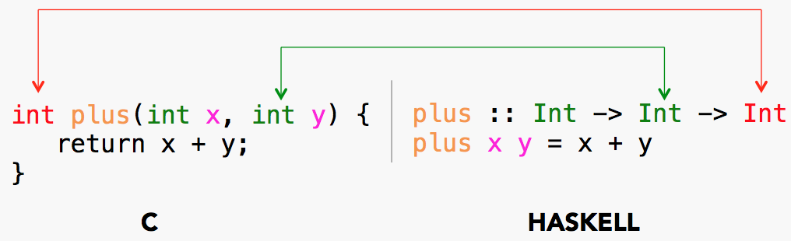

# Intro to Haskell
so `plus`{.orangec} takes two `int`{.greenc}s and returns an `int`{.greenc}


# Intro to Haskell
spaces separate `name bindings`{.magentac} instead of commas


# Type Errors

<div class="mdl-grid">
<div class="mdl-cell mdl-cell--4-col">
```{.haskell .numberLines}
plusfive :: Int -> Int
plusfive x = x + 5

>>> plusfive 4
9

>>> plusfive 4.0
 error: "not an Int"
```
</div>
<div class="mdl-cell mdl-cell--7-col">
```{.haskell .numberLines}
andfive :: String -> String
andfive x = x <> "andfive" --concatenates strings

>>> andfive "4"           -- strings are doublequoted
"4andfive"

>>> andfive 4             -- inferred type
 error: "not a String"

>>> andfive (4 :: Int)    -- explicit type annotation
 error: "not a String"

>>> andfive (4 :: String) -- no casting allowed
 error: "No instance for (Num String)
         arising from the literal 4"
```
</div>
</div>

# Networks, Databases, Stdout
* a pure function like this can't perform IO

```haskell
addTwoNumbers :: Int -> Int -> Int
```

* Wrap pure computations inside an `IO`{.redc} action context

```haskell
plusAndPrint :: Int -> Int -> IO Int
```

<div class="mdl-grid">
<div class="mdl-cell mdl-cell--1-col"></div>
<div class="mdl-cell mdl-cell--6-col">

```{.haskell .numberLines}
plus :: Int -> Int -> Int
plus x y = x + y

plusAndPrint :: Int -> Int -> IO Int
plusAndPrint x y = do
  let result = plus x y
  print result
  return result
```
</div>
<div class="mdl-cell mdl-cell--3-col">
```haskell
$ cd examples/addtwonumbers
$ stack addTwoNumbers.hs
plusAndPrint 3 5
8
```
</div>

# Calling Functions in Haskell

Filtering a list

<div class="mdl-grid"><div class="mdl-cell mdl-cell--6-col">
```haskell
removeBigNumbers :: Int -> Bool
removeBigNumbers x = x < 6
```
</div><div class="mdl-cell mdl-cell--6-col">
```haskell
>>> filter removeBigNumbers [0,1,2,3,4,5,6,7,8,9,10]
[0,1,2,3,4,5]
```
</div></div>

. . .

<div class="mdl-grid"><div class="mdl-cell mdl-cell--6-col">
```haskell
staticTypes :: String -> Bool
staticTypes lang
  | lang == "javascript" = False
  | lang == "ruby"       = False
  | lang == "haskell"    = True
  | lang == "scala"      = True
  | otherwise            = True --oops

```
</div><div class="mdl-cell mdl-cell--6-col">
```haskell
>>> filter staticTypes ["javascript", "python", "haskell"]
["python","haskell"]
  ^ oops
```
</div></div>

Program against types instead of strings

# Exercise 1 -- Haskell 101

<div class="mdl-grid"><div class="mdl-cell mdl-cell--6-col">
```haskell
-- an enum
data Languages = JavaScript
               | Ruby
               | Haskell
               | Scala
               | Python
```
</div><div class="mdl-cell mdl-cell--6-col">
```haskell
betterStaticTypes :: Languages -> Bool
betterStaticTypes lang = case lang of
  JavaScript  -> False
  Ruby        -> False
  Haskell     -> True
  Scala       -> True
  Python      -> False
```
</div></div>

. . .

<div class="mdl-grid"><div class="mdl-cell mdl-cell--6-col">
If you forget a case:

```haskell
  ...
  Scala       -> True
  --Python      -> False
```

```
warning: [-Wincomplete-patterns]
    Pattern match(es) are non-exhaustive
    In a case alternative: Patterns not matched: Python
```
</div><div class="mdl-cell mdl-cell--6-col">
If you mix strings in:

```haskell
>>> filter betterStaticTypes [Haskell, Python]
[Haskell]
>>> filter betterStaticTypes [Haskell, "bash"]
```

```
Couldn't match expected type ‘Languages’
                  with actual type ‘String’
    > In the expression: "bash"
    > In the second argument of ‘filter’,
      namely ‘[Haskell, "bash"]’
```
</div></div>


# Exercise 1 - Try it out

```haskell
data Languages = JavaScript | Haskell | ... (your fav language) | Python deriving (Eq, Show)

betterStaticTypes :: Languages -> Bool
betterStaticTypes lang = case lang of
  JavaScript  -> False
  Ruby        -> False
  Haskell     -> True
  Scala       -> True
  Python      -> False
  -- add a case here

print $ filter betterStaticTypes [Haskell, ..., (add your language)]
```

```bash
$ docker run --rm -it mmaz/secdev /bin/bash
$ secdev> emacs Intro.hs  #switch to pure emacs: SPC t E e
$ secdev> ghc -Wall -fforce-recomp Intro.hs

  Intro.hs:17:26: warning: [-Wincomplete-patterns]
      Pattern match(es) are non-exhaustive
      In a case alternative: Patterns not matched: YourLanguage

$ secdev> runghc Intro.hs

  ...
  [Haskell,...your language]

$ secdev> exit #or Ctrl-D
```

(continuous typechecking: `stack build --file-watch --fast`)

Ex 2: `LiquidHaskell`
========================

Verify `absolutevalue` always returns a positive number:

Change `x < 0`{.haskell} to `x > 0`{.haskell} in this example:

```haskell
{-@ absolutevalue :: Int -> { n : Int | 0 <= n }    @-}
    absolutevalue :: Int -> Int
    absolutevalue x = if x < 0 then negate x else x
```

`{ n : Int | 0 <= n }`{.haskell} returns `n :: Int`{.haskell} such that `0`{.haskell} is less than or equal to `n`{.redc}

```bash
$ docker run --rm -it mmaz/secdev /bin/bash
$ secdev> emacs HelloLiquid.hs  #switch to pure emacs: SPC t E e
$ secdev> liquid HelloLiquid.hs

  **** RESULT: SAFE ****
   or
  **** RESULT: UNSAFE ****

$ secdev> exit #or Ctrl-D
```

`LiquidHaskell` Proofs
========================

<div class="mdl-grid">
<div class="mdl-cell mdl-cell--6-col">

</div>
<div class="mdl-cell mdl-cell--6-col">
* Binary serialization lib `fpco/store`
* Fast as `memcpy`
* Safe: no access violations outside bytebuffer
* After adding constraints, fails to compile until negative numbers are handled:
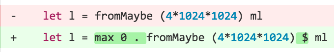
</div>
</div>

`LiquidHaskell` can enforce many security properties - see HeartBleed example:

[ucsd-progsys.github.io/liquidhaskell-tutorial/11-case-study-pointers](http://ucsd-progsys.github.io/liquidhaskell-tutorial/11-case-study-pointers.html)

# Gaussian Blobs

<!-- * function `f`{.redc} -->
<!--     * takes any coordinate `(x,y)`{.redc} -->
<!--     * evaluates blob value -->
<!--     * zero at most coordinates -->
<!--     * `f = alpha`{.redc} at $(x_0, y_0)$ -->
<div class="mdl-grid">
<div class="mdl-cell mdl-cell--6-col">


$f(x,y) = \alpha \cdot \exp(- (\frac{(x - x_0)^2}{2\sigma^2_x} + \frac{(y - y_0)^2}{2\sigma^2_y}))$

```haskell
gaussian ::
GaussianParameters Float -> Float -> Float -> Float
^ (sigmas, x0, y0...)       ^ x      ^ y      ^ f(x,y)
```
</div>
<div class="mdl-cell mdl-cell--6-col">

```haskell
data GaussianParameters a = GaussianParameters {
  sigmaX :: a
, sigmaY :: a
, x0     :: a
, y0     :: a
, alpha  :: a }
```

* `a`{.magentac} is a type parameter
* Substitute `Float`{.haskell},  `Double`{.haskell}, `Int`{.haskell} ...
* *constrain* `a`{.magentac} with "`=>`{.haskell}"

```haskell
gaussian :: (Fractional a) =>
            GaussianParameters a -> a -> a -> a
gaussian GaussianParameters{..} x y =
  alpha * exp ( negate (  xnumerator / xdenominator
                        + ynumerator / ydenominator) )
  where
    xnumerator   = (x - x0) ** 2
    xdenominator = 2 * (sigmaX ** 2)
    ynumerator   = (y - y0) ** 2
    ydenominator = 2 * (sigmaY ** 2)
```
</div>
</div>

# GHCJS Demo: Click to try it!

```{.runhaskell .numberLines}
start :: MonadWidget t m => m ()
start = do
  gaussians <- grid $ do
    g1 <- cell6 parameters
    g2 <- cell6 parameters
    return $ (\x y -> quantizeGaussian [x,y]) <$> g1 <*> g2
  initG <- sample $ current gaussians
  performEvent_ (liftIO . plotAction <$> updated gaussians)
---
```

<div class='mdl-grid'><div class='mdl-cell mdl-cell--6-col'>
<div id="topdown"></div>
</div><div class='mdl-cell mdl-cell--6-col'>
<div id="threed"></div>
</div></div>

<!--
  --
  --
  -- User Input Santization -- Phantom Types
  --
  --
  -->

# Phantom Types for Enforced Sanitization


<div class="footnote">
[Source: XKCD](https://xkcd.com/327/)
</div>

# Injection Attacks, Simplified

* Executing user input as code is dangerous!

* For example, assume you assemble an insert statement by concatenating some strings:
```sql
"INSERT INTO person (name) VALUES ('" + name + "')"
```

* Substitute, for name:
```sql
name = Robert'); drop table person; --
```

* And you get:
```sql
INSERT INTO person (name) VALUES ('Robert'); drop table person; --')
```

# Let's Get Some Setup Out of the Way

```{.haskell .numberLines}
initDB :: IO Database
initDB = do
  conn <- open ":memory:"                                             -- create in memory database
  exec conn "CREATE TABLE person (id INTEGER PRIMARY KEY, name TEXT)" -- initialize table
  exec conn "INSERT INTO person (name) VALUES ('Tim')"
  exec conn "INSERT INTO person (name) VALUES ('Mark')"               -- insert some data
  exec conn "INSERT INTO person (name) VALUES ('Sarah')"
  return conn                                                         -- return connection for future access to DB

readDB :: Database -> IO ()
readDB = flip execPrint "select * from person"                        -- print database contents to stdout

closeDB :: Database -> IO ()
closeDB =  close                                                      -- cleanup database
```

(raw SQL statements are in green doublequotes)

# Remember to Sanitize User Input

```{.haskell .numberLines}
insertDB :: Database -> Text -> IO ()                               -- make the horrible mistake of
insertDB conn name =                                                -- building up an insert statement by
  exec conn $ "INSERT INTO person (name) VALUES ('" <> name <> "')" -- string concatenation

-- Please don't use this sanitization function in real life!
sanitize :: Text -> Text                                            -- hokey sanitization function that strips
sanitize =                                                          -- off the rest of the sql statement once
  takeWhile (`notElem` [';','\'','"'])                              -- it encounters one of [; ' "]
```

Sanitization will only work if the developer remembers to
call sanitize before every call to `insertDB`{.haskell}

# Let's Get Some Help From the Type System

# Phantom Types

<div class='mdl-grid'><div class='mdl-cell mdl-cell--6-col'>
Lame types
</div><div class='mdl-cell mdl-cell--6-col'>
Fancy types
</div></div>

. . .

<div class='mdl-grid'><div class='mdl-cell mdl-cell--6-col'>
types narrowed from any `Text`{.haskell}
```haskell
UserInput
```
</div><div class='mdl-cell mdl-cell--6-col'>
types differentiate safe and unsafe
```haskell
UserInput Clean, UserInput Dirty
```
</div></div>

. . .

<div class='mdl-grid'><div class='mdl-cell mdl-cell--6-col'>
augment with cleanliness flag
```haskell
data UserInput = UserInput {
    input   :: Text
  , isClean :: Boolean
}
```
</div><div class='mdl-cell mdl-cell--6-col'>
cleanliness maintained in the type
```haskell
data Clean
data Dirty

newtype UserInput a = UserInput { input :: Text }
```
</div></div>

. . .


<div class='mdl-grid'><div class='mdl-cell mdl-cell--6-col'>
runtime validation, error handling
</div><div class='mdl-cell mdl-cell--6-col'>
compile time verification
</div></div>

. . .

<div class='mdl-grid'><div class='mdl-cell mdl-cell--6-col'>
carry additional boolean etc. at runtime
</div><div class='mdl-cell mdl-cell--6-col'>
no runtime cost
</div></div>

# A Phantom User Input

```{.haskell .numberLines}
module MySafeStore                    -- carefully control what is visible outside of module
  (
    ...

  , UserInput                         -- only export the type of UserInput, not its constructor
  , readInput                         -- export readInput so we can convert Text to UserInput

  ) where

data Clean                            -- create types Clean and Dirty, with no values
data Dirty

newtype UserInput a = UserInput {     -- put phantom type parameter a in UserInput
  input :: Text
}

readInput :: Text -> UserInput Dirty  -- force bare Text values to begin life Dirty
readInput = UserInput
```

# Phantoms Can Force Cleanliness

```{.haskell .numberLines}
insertDB :: DataStore -> UserInput Clean -> IO ()                         -- we still concatenate strings to
insertDB DataStore{..} UserInput{..} =                                    -- build up sql statements, but we
  exec conn $ "INSERT INTO person (name) VALUES ('" <> input <> "')"      -- only accept sanitized input

-- Please don't use this sanitization function in real life!
sanitize :: UserInput Dirty -> UserInput Clean                            -- the only public way to
sanitize =                                                                -- sanitize a UserInput Dirty
  UserInput . takeWhile (`notElem` [';','\'','"']) . input
```

* Only way to convert a `UserInput Dirty`{.haskell} into a `UserInput Clean`{.haskell} is `sanitize`{.haskell}

# Exercise 3 -- SQL Injection

```{.haskell .numberLines}
main :: IO ()
main = main1 -- unsanitized version

main1 = do
  conn <- initDB
  print "Contents of initial database:"
  readDB conn

  insertDB conn "Haskell Curry"
  print "Contents after insert of our saint"
  readDB conn

  insertDB conn (sanitize "Evil'); drop table person; --")
  print "Contents after allowing my sadistic co-worker to use my library"
  readDB conn

  insertDB conn "Evil'); drop table person; --"
  print "Contents after allowing my sadistic co-worker to use my library a second time"
  readDB conn
{-
main2 :: IO ()
main2 = ...
-}
```

```
$ docker run --rm -it mmaz/secdev /bin/bash
$ secdev> stack runghc PhantomTypes.hs
```
* Play with the unsafe version, making edits
* Uncomment `main2`, import safe module, update `main`, and discover that you can no longer inject

<!--
  --
  --
  -- Servant
  --
  --
  -->

# Servant -- A Web API as a Type


<div class="footnote">
[Source: XKCD](https://xkcd.com/1481/)
</div>


# Crash Course on JSON
```{.haskell }
data HelloWorld = HelloWorld          -- create a new type called HelloWorld

instance ToJSON HelloWorld where      -- manual JSON definition
  toJSON =
    const $ object [ "hello" .= ("world" :: Text) ]
```

```{.haskell }
>>> encode HelloWorld
{"hello":"world"}
```

. . .

<div class='mdl-grid'><div class='mdl-cell mdl-cell--6-col'>
```{.haskell }
data Car = Car {
  make  :: String
, model :: String
, year  :: Int
} deriving (Generic)
instance ToJSON Car
--Generic: figure out how to JSON for me!
```
</div><div class='mdl-cell mdl-cell--6-col'>

```{.haskell }
>>> mycar = Car "Toyota" "Prius" 2013
         -- Car("Toyota", "Prius", 2013)

>>> encode mycar
{"year":2013,"model":"Prius","make":"Toyota"}
```
</div></div>

`DataKinds`: Values to Types
=================

* `3`{.magentac} is a `Value`{.redc}

* `Int`{.haskell} is a `Type`{.greenc}

* `DataKinds`{.haskell} promotes `Value`{.redc}s to `Type`{.greenc}s

* URL path components `foo`{.magentac} and `bar`{.magentac}
    * without `DataKinds`{.haskell}, they're `String`{.haskell} values

* Type-level strings promote a route `/foo/bar`{.greenc} to a type

Blogpost with details: [arow.info/blog/posts/2015-07-10-servant-intro](http://www.arow.info/blog/posts/2015-07-10-servant-intro.html)

# Web Services with Servant

```haskell
--  represent 'GET /sayhello/' as a type:

type API = "sayhello" :> Get '[JSON] HelloWorld

helloHandler = return HelloWorld                           -- {"hello":"world"}

main = run 8080 $ serve (Proxy :: Proxy API) helloHandler  -- serve on port 8080
```

<div class='mdl-grid'><div class='mdl-cell mdl-cell--6-col'>
In one terminal window:
```bash
$ docker run -p 8080:8080 --rm -it mmaz/secdev /bin/hello-servant
```
</div><div class='mdl-cell mdl-cell--6-col'>
In another terminal window:
```bash
$ curl localhost:8080/sayhello
{"hello":"world"}
```
</div></div>

# Web Services with Servant

```haskell
-- the type of 'GET /tesla/Int'
type API = "tesla" :> Capture "year" Int  :> Get '[JSON] Car

carHandler :: Int -> Handler Car
carHandler inputyear
  | inputyear < 2012 =  throwError $ err501 { errBody = "too old!"}
  | otherwise        =  return $ Car "Tesla" "Model S" inputyear


main = run 8080 $ serve (Proxy :: Proxy API) carHandler
```

<div class='mdl-grid'><div class='mdl-cell mdl-cell--6-col'>
```bash
$ docker run -p 8080:8080 --rm -it mmaz/secdev /bin/hello-servant
```
</div><div class='mdl-cell mdl-cell--6-col'>
```bash
$ curl localhost:8080/tesla/2011
"too old!"
$ curl localhost:8080/tesla/2016
{"year":2016,"model":"Model S","make":"Tesla"}
```
</div></div>

# Types as a Lightweight Specification

```{.haskell .numberLines}
data Status = OK | Fail
  deriving (Generic, Show, Read, Ord, Eq)

data Log = Log {
  ident :: Int
, timestamp :: Int
, message :: Text
} deriving (Generic, Show, Typeable)
```

. . .

<div class="mdl-grid"><div class="mdl-cell mdl-cell--8-col">
```{.haskell}
type LogApi = "logs" :> Get '[JSON] [Log]
         :<|> "log"  :> ReqBody '[JSON] Log :> Post '[PlainText] Status
         :<|> "log"  :> Capture "id" Int :> Get '[JSON] Log
```

</div><div class="mdl-cell mdl-cell--4-col">
```html
GET /logs
POST {JSON content} /log
GET /log/1
```

</div></div>

The API type specifies the http method, argument types, and return types

# Exercise 4 -- Match Servant API To Handlers

```{.haskell .numberLines}
server :: Server LogApi
server = undefined :<|> undefined :<|> undefined

foo :: Log -> Handler Status
foo _ = return OK

bar :: Handler [Log]
bar = return [
    Log {ident = 1, timestamp = 101, message = "msg1"}
  , Log {ident = 2, timestamp = 201, message = "msg2"}
  ]

baz :: Int -> Handler Log
baz n = return Log {ident = n, timestamp = 102, message = "message"}
```

* Compiler checked server implementation
* Server is combination of handlers
* Task: fill in server implementation

# Leveraging the Specification

```haskell
-- Generate clients for our api
(getLogs :<|> postLog :<|> getLogById) = client logApi

-- Generate Swagger specification of api
swaggerDocs :: Swagger
swaggerDocs = toSwagger logApi
```

* Types specific enough to generate clients and Swagger API specification
* Swagger specification can generate clients in many languages
* Type-checked documentation, never out of sync!


# Swagger Docs Generated for LogApi

{ width=80% }

# Swagger Docs Generated for LogApi

{ width=80% }

# Swagger Docs Generated for LogApi

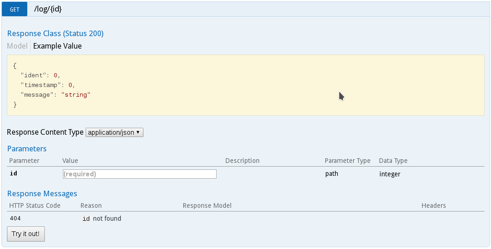{ width=80% }


<!-------------------------------------------
  --                                       --
  --                                       --
  -- Functional Reactive Programming       --
  --                                       --
  --                                       --
  ------------------------------------------->

# Functional Reactive Programming


<div class="footnote">
[Source: XKCD](https://xkcd.com/1270/)
</div>

# Reflex -- a FRP Library for Haskell

<div class="mdl-grid">
<div class="mdl-cell mdl-cell--2-col"></div>
<div class="mdl-cell mdl-cell--4-col">
{ width=100% }
</div><div class="mdl-cell mdl-cell--4-col">
{ width=100% }
</div>
<div class="mdl-cell mdl-cell--2-col"></div>
</div>

* Web bindings through `reflex-dom`
     * Haskell code compiled to Javascript via GHCJS

* FRP abstractions from Reflex:
     * Behavior - value as a function of time
     * Event - stream of discrete values
     * Dynamic - some combination of the above

Point of Order
==============

Many of the following slides will have the format:
code snippet followed by the rendered results
of executing that code in the DOM.

```{.haskell}
-- haskell code snippet that executes
-- changes to the DOM, results of which
-- would be rendered below
```

<div class="runCode" style="margin-top: 2em;">
  divs like this are results of executing code snippet
</div>

Reflex Example (1)
==================

```{.runhaskell .numberLines}
start :: MonadWidget t m => m ()
start = do
  el "div" (text "hello")
```

# Maps and Folds

Some useful functions:

<div class="mdl-grid">
<div class="mdl-cell mdl-cell--2-col"></div>
<div class="mdl-cell mdl-cell--4-col">
```{.haskell .numberLines}
fmap :: (a -> b) -> [a] -> [b]
fmap = ...

fold :: (a -> b -> b) -> b -> [a] -> b
fold = ...

const :: a -> b -> a
const = ...
```
</div>
<div class="mdl-cell mdl-cell--4-col">
```{.haskell}
>>> fmap (plus 5) [0,3]
[5,8]

>>> fold plus 0 [1,2,3,4]
10 -- == 0 + 1 + 2 + 3 + 4

>>> const "foo" "bar"
"foo"
```
</div>
<div class="mdl-cell mdl-cell--2-col"></div>
</div>


Reflex Example (2)
===================

```{.runhaskell .numberLines}
start :: MonadWidget t m => m ()
start = mdo
  inp <- mdlInput ""                  -- create input element
  let inpEv   = _textInput_input inp  -- grab the keypress events

  inpValDyn <- foldDyn const "" inpEv -- build dynamic from input events

  el "div" (display inpValDyn)        -- render contents of above dynamic
```

Reflex Example (3)
==================

```{.runhaskell .numberLines}
start :: MonadWidget t m => m ()
start = mdo
  inp <- mdlInput' "" clickEv                      -- create input element
  b   <- btn "clear"                               -- create button

  let inpEv   = _textInput_input inp               -- grab input events
      clickEv = fmap (const "") (domEvent Click b) -- grab button click events
      combEv  = appendEvents clickEv inpEv         -- merge input and click events

  inpValDyn <- foldDyn const "" combEv             -- create dynamic over combined events

  el "div" (display inpValDyn)                     -- render contents of dynammic
```

# XSS -- Executing User Code Within the Browser

```{.runhaskell .numberLines}
start :: MonadWidget t m => m ()
start = grid $ do
  cell2 blank
  cell8 $ do
    let defInp  = "<span>spooky user input</span>"

    inp <- mdlInput defInp                                 -- create input element
    let inpEv   = _textInput_input inp                     -- grab input events

    safeDyn   <- foldDyn (\n _ -> sanitize n) defInp inpEv -- dynamic with sanitized input
    unsafeDyn <- foldDyn const defInp inpEv                -- dynamic with raw input

    grid $ do
      cell5 $ mdlTitleCard "Sanitized"    "clsf"   $ elDynHtml' "span" safeDyn
      cell2 blank
      cell5 $ mdlTitleCard "Un-Sanitized" "clunsf" $ elDynHtml' "span" unsafeDyn
    blank
  cell2 blank
```

# XSS -- Wrapping a Library for Safety

```{.haskell .numberLines}
elDynHtmlUnsafe :: MonadWidget t m => Text -> Dynamic t Text -> m (El t)
elDynHtmlUnsafe e = ...

-- safe version of elDynHtml'
elDynHtml :: MonadWidget t m => Text -> Dynamic t (UserInput Clean) -> m (El t)
elDynHtml e = elDynHtmlUnsafe e . fmap getInput
```

Same idea as database example -- potentially unsafe functions now only accept properly
sanitized input

# Complete XSS Example -- Server

```{.haskell .numberLines}
type SanitizeApi =
       "sanitize" :> ReqBody '[PlainText] Text :> Post '[PlainText] Text -- POST for sanitization
  :<|> Raw                                                               -- serve static content

sanitizer :: Text -> Handler Text                                        -- Servant handler that
sanitizer = return . sanitize                                            -- wrap our friend sanitize

endpoints :: Server SanitizeApi
endpoints = sanitizer :<|> serveDirectory "static"                       -- the server

main :: IO ()
main = run 8080 $ serve (Proxy :: Proxy SanitizeApi) endpoints           -- run the thing
```

Simple server serves some static content (index.html, css, js) and provides a
post function to sanitize content

# Complete XSS Example -- Sanitize Request
```{.haskell .numberLines}
sanitize :: MonadWidget t m => Event t (UserInput Dirty) -> m (Event t (UserInput Clean))
sanitize inp = do
  evResp <- performRequestAsync $ fmap makeReq inp        -- build a XhrRequest and send it

  let evInp = _xhrResponse_responseText <$> evResp        -- when the XhrResponse Event fires, wrap
  return $ fmap (maybe (UserInput "") UserInput) evInp    -- up in the correct UserInput type

makeReq :: UserInput Dirty -> XhrRequest Text             -- plumbing for building up the XhrRequest
makeReq inp =
  xhrRequest
    "POST" "/sanitize"
    (def {_xhrRequestConfig_sendData = (getInput inp)} )
```
Upon every key press, we send the input back to the server to sanitize it.

# Complete XSS Example -- Demo

Ex 5: Type-Level Functions
=============================

```{.haskell .numberLines}
data Democrat   = Obama   | LBJ                     -- create some enums
data Republican = Lincoln | Eisenhower

class (Policy p) => Politician p where              -- define Policy, scoped to specific party
  data Policy p :: *
  govern :: p -> Policy p

instance Politician Democrat where                  -- define Democrats, with their policies
  data Policy Democrat = Obamacare | CivilRights
  govern Obama = Obamacare
  govern LBJ   = CivilRights

instance Politician Republican where                -- define Republicans, with their policies
  data Policy Republican = EstablishNASA | ThirteenthAmendment
  govern Lincoln    = ThirteenthAmendment
  govern Eisenhower = EstablishNASA

data Strategy = Subsidize | Amend | Legislate       -- one more enum

class (Politician p) => Enact p where               -- politicians are only allowed to enact
  enact :: p -> Strategy                            -- their own policies

instance Enact Democrat where
  enact p = case govern p of                        -- type level determination of allowed
    Obamacare   -> Subsidize                        -- policies for Democrats
    CivilRights -> Legislate

instance Enact Republican where                     -- type level determination of allowed
  enact p = case govern p of                        -- policies for Republicans
    ThirteenthAmendment -> Amend
    EstablishNASA       -> Subsidize
```

Type-Level Functions
=======================

`TypeFamilies` and `Proxy` let Servant compute Authentication types

```haskell
type AuthAPI = "private" :> AuthProtect "cookie-auth" :> PrivateAPI
          :<|> "public"  :> PublicApi

-- Type Function to compute the type of data returned after authentication
type instance AuthServerData (AuthProtect "cookie-auth") = Account
```

`TypeFamilies` allow Servant to have multiple authentication schemes protecting an API

# Resources

* Haskell
     - [Haskell Language Site](https://www.haskell.org/)
     - [Haskell From First Principles](http://haskellbook.com/)
     - [Stack buid tool](https://docs.haskellstack.org/en/stable/README/)
     - [Haskell to Javascript Compiler](https://github.com/ghcjs/)

* Servant
     - [Servant Intro](http://www.arow.info/blog/posts/2015-07-10-servant-intro.html)
     - [Servant Documentation](https://haskell-servant.readthedocs.io/en/stable/)

* Functional Reactive Programming, Reflex
     - [Manning Book: Functional Reactive Programming](https://www.manning.com/books/functional-reactive-programming)
     - [Ryan Trinkle - Managing Complexity](http://www.infoq.com/presentations/functional-techniques-complexity)

* [Fun With Type Functions](http://research.microsoft.com/en-us/um/people/simonpj/papers/assoc-types/fun-with-type-funs/typefun.pdf)

# Supplementary Topics

# Don't Mix IO

This is not the Haskell way:

```java
insertDB(Row, "foo");
result = Network.request("bar");
tryLock { myCriticalVar = result; }
catch {blah}
```

# Simple Example: Shared State
* increment the number of `u`s in `yuuuuge`

```bash
$ curl localhost:8080/yuge/1
"not yuge enough!"
$ curl localhost:8080/yuge/2
"yuuge"
$ curl localhost:8080/yuge/7
"yuuuuuuuge"
$ curl localhost:8080/yuge/5
"not yuuuuuuuge enough!"
```

What did we last set `yuge` to?

```bash
$ curl localhost:8080/yuge
{"pronunciation":"yuuuuuuuge","howyuge":7}

```

# Make a variable in Haskell

<div class="mdl-grid">
<div class="mdl-cell mdl-cell--6-col">
```haskell
data Yuge = Yuge {
  howyuge :: Int
, pronunciation :: Text
} deriving (Generic)
instance ToJSON Yuge

type MyStore = TVar Yuge
```
</div>
<div class="mdl-cell mdl-cell--6-col">
```haskell
Yuge {
   howyuge = 3
   pronunciation = "yuuuge"
}                    ^^^


MyStore = STM container for Yuge
```
</div>
</div>

* `MyStore` is like a variable, except better
* `howyuge` and `pronunciation` will never have a race condition
* STM: "just-works" concurrency
    * no event loop spaghetti
    * no locking orders

# How do we incorporate this in Servant?

<div class="mdl-grid">
<div class="mdl-cell mdl-cell--6-col">
```haskell
makeYuge :: Int -> Yuge
makeYuge numUs = Yuge numUs ("y" <> uuu <> "ge")
  where uuu = T.pack $ replicate numUs 'u'

tryIncreasingYuge :: Int
                  -> MyStore
                  -> ExceptT ServantErr STM Yuge
tryIncreasingYuge requestedUs yugeStore = do
  currentYuge <- read yugeStore
  if requestedUs <= howyuge currentYuge
    then throwError
      err501 { "not " <> currentYuge <>  " enough!"}
    else do
      let newyuge = makeYuge requestedUs
      write yugeStore newyuge
      return newyuge
```
</div>
<div class="mdl-cell mdl-cell--6-col">
```haskell
makeYuge(numUs) {
  Yuge(numUs, ("y" + 'u' * numUs + "ge"))
} -- returns a Yuge(int, text)

tryIncreasingYuge :: number of Us
                  -> global variable
                  -> ExceptT ServantErr STM Yuge
tryIncreasingYuge(requestedUs, yugeStore) {
  try to increase yugeStore:
  if requestedYuge < yugeStore
      then error msg
      else (1) perform the update
           (2) return the new Yuge
}
```
</div>
</div>

Let us first understand this return type
```haskell
tryIncreasingYuge :: Int -> MyStore -> ExceptT ServantErr STM Yuge
tryIncreasingYuge requestedYuge yugeStore = ???
```


# Understanding Big Types
{ width=70% }

# Understanding Big Types
{ width=70% }

# Understanding Big Types
{ width=70% }

# Understanding Big Types
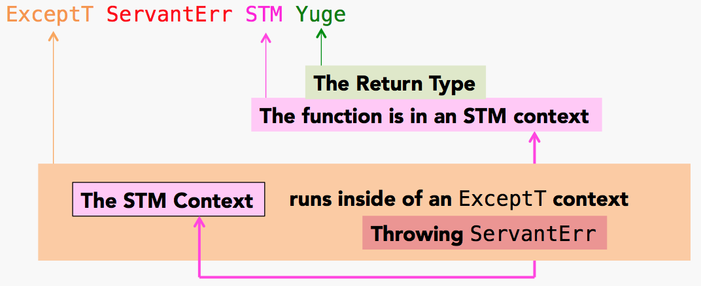{ width=70% }

# Understanding Big Types
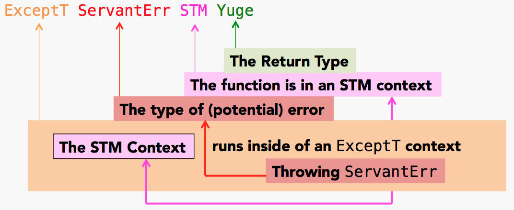{ width=70% }

# How do we incorporate this in Servant?

<div class="mdl-grid">
<div class="mdl-cell mdl-cell--6-col">
```haskell
makeYuge :: Int -> Yuge
makeYuge numUs = Yuge numUs ("y" <> uuu <> "ge")
  where uuu = T.pack $ replicate numUs 'u'

tryIncreasingYuge :: Int
                  -> MyStore
                  -> ExceptT ServantErr STM Yuge
tryIncreasingYuge requestedUs yugeStore = do
  currentYuge <- read yugeStore
  if requestedUs <= howyuge currentYuge
    then throwError
      err501 { "not " <> currentYuge <>  " enough!"}
    else do
      let newyuge = makeYuge requestedUs
      write yugeStore newyuge
      return newyuge
```
</div>
<div class="mdl-cell mdl-cell--6-col">
```haskell
makeYuge(numUs) {
  Yuge(numUs, ("y" + 'u' * numUs + "ge"))
} -- returns a Yuge(int, text)

tryIncreasingYuge :: number of Us
                  -> global variable
                  -> ExceptT ServantErr STM Yuge
tryIncreasingYuge(requestedUs, yugeStore) {
  currentYuge <- read yugeStore
  if requestedUs <= currentYuge
    then throwError
      err = current # of 'U's too small
    else do
      let newyuge = makeYuge requestedUs
      store and return the update
}
```
</div>
</div>

{ width=40% }


<!-- * The big type signature `ExceptT ServantErr STM Yuge` says three things to us. We can return a Servant exception, we can return a Yuge, or we can modify in-memory state. -->
<!-- * We can't `printf` or `launchMissles` or `deleteDatabase` or `reboot` anywhere inside `tryIncreasingYuge`. By reading the type we know that there's no funny business like network connections taking place in the implementation. -->
<!-- * We know that in `makeYuge` we don't even have the ability to edit an STM variable. It's completely pure. -->

# The benefit

* Types determine what operations are permitted
    * In the STM monad you can't do network or database IO
* Composable "separation of concerns"


# How do we call this from a Servant handler?

```haskell
setYuge :: Int -> ReaderT MyStore (ExceptT ServantErr IO) Text
setYuge requestedUs = do
  yugeStore <- ask
  pronunciation <$> lift (hoist atomically (tryIncreasingYuge requestedUs yugeStore))
```

* Servant handlers are in IO. This means we have to `hoist` our monad stack.

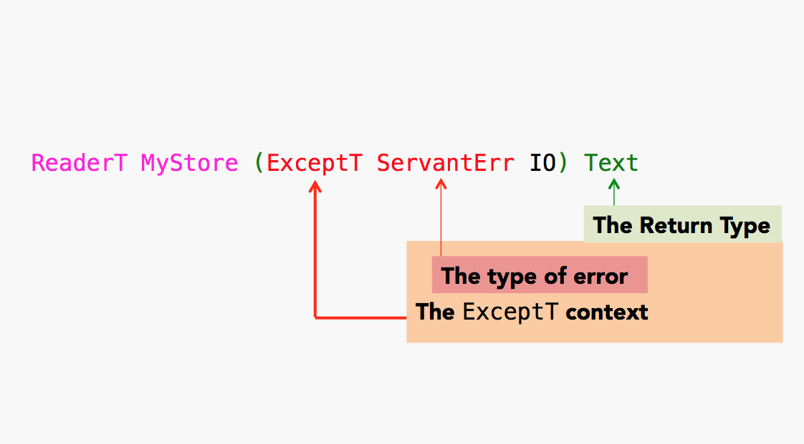{ width=50% }

# How do we call this from a Servant handler?

```haskell
setYuge :: Int -> ReaderT MyStore (ExceptT ServantErr IO) Text
setYuge requestedUs = do
  yugeStore <- ask
  pronunciation <$> lift (hoist atomically (tryIncreasingYuge requestedUs yugeStore))
```

* Servant handlers are in IO. This means we have to `hoist` our monad stack.

{ width=50% }

# How do we call this from a Servant handler?

```haskell
setYuge :: Int -> ReaderT MyStore (ExceptT ServantErr IO) Text
setYuge requestedUs = do
  yugeStore <- ask
  pronunciation <$> lift (hoist atomically (tryIncreasingYuge requestedUs yugeStore))
```

* Servant handlers are in IO. This means we have to `hoist` our monad stack.

{ width=50% }

# How do we call this from a Servant handler?

```haskell
setYuge :: Int -> ReaderT MyStore (ExceptT ServantErr IO) Text
setYuge requestedUs = do
  yugeStore <- ask
  pronunciation <$> lift (hoist atomically (tryIncreasingYuge requestedUs yugeStore))
```

* Servant handlers are in IO. This means we have to `hoist` our monad stack.

{ width=50% }

# How do we call this from a Servant handler?

```haskell
setYuge :: Int -> ReaderT MyStore (ExceptT ServantErr IO) Text
setYuge requestedUs = do
  yugeStore <- ask
  pronunciation <$> lift (hoist atomically (tryIncreasingYuge requestedUs yugeStore))
```

* Servant handlers are in IO. This means we have to `hoist` our monad stack.

{ width=50% }

# How do we call this from a Servant handler?

```haskell
setYuge :: Int -> ReaderT MyStore (ExceptT ServantErr IO) Text
setYuge requestedUs = do
  yugeStore <- ask
  pronunciation <$> lift (hoist atomically (tryIncreasingYuge requestedUs yugeStore))
```

* Servant handlers are in IO. This means we have to `hoist` our monad stack.

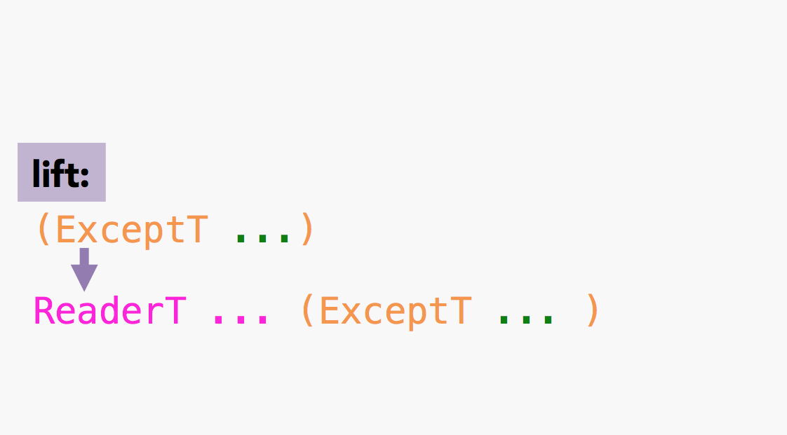{ width=50% }

# These are generic functions!
{ width=60% }
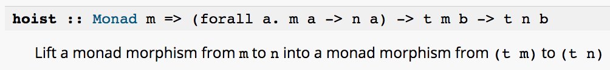{ width=70% }
